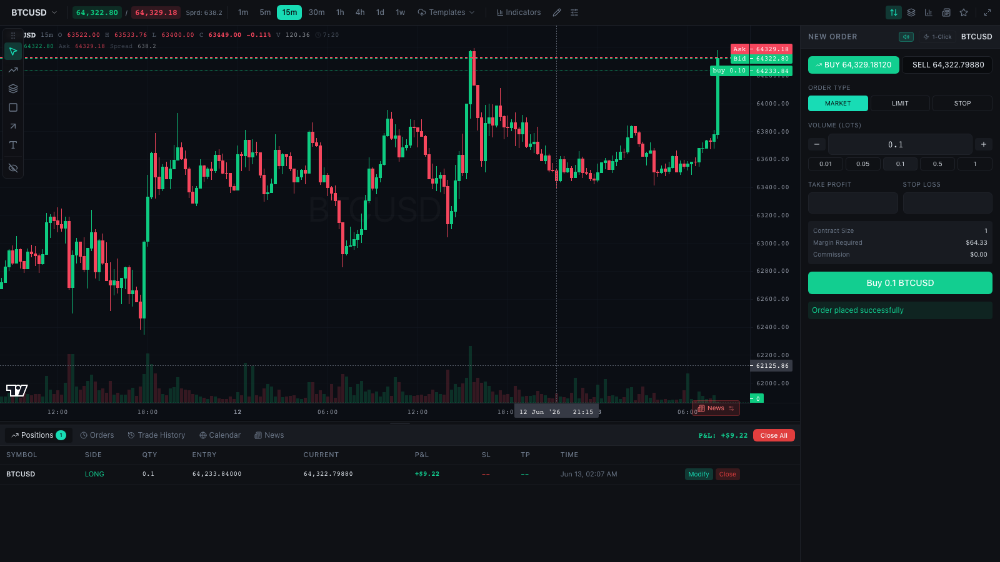

<div align="center">

# 📈 OpenCharts


**An open-source trading terminal that runs entirely in your browser — no backend, no signup, no API keys.**

Advanced charting · full drawing-tool suite · watchlist · depth-of-market · order panel · built-in paper-trading engine, seeded with **real** market history.



</div>

---

## Table of contents

- [What is OpenCharts?](#what-is-opencharts)
- [Features](#features)
- [Quick start](#quick-start)
- [How it works](#how-it-works)
- [Project structure](#project-structure)
- [Refreshing the bundled market data](#refreshing-the-bundled-market-data)
- [Bring your own data / backend](#bring-your-own-data--backend)
- [Adding instruments](#adding-instruments)
- [Scripts](#scripts)
- [Tech stack](#tech-stack)
- [Known limitations](#known-limitations)
- [Contributing](#contributing)
- [Acknowledgements](#acknowledgements)
- [License](#license)

---

## What is OpenCharts?

OpenCharts is a self-contained, professional-grade **trading terminal UI**. Open it
and you land straight in a live-feeling terminal: a candlestick chart with a full
drawing toolbar, a watchlist, a depth-of-market ladder, and an order ticket — all
wired to an **in-browser paper-trading engine**.

There is **no server to run**. The demo session is seeded with *genuine* historical
OHLC data (pulled from a public exchange API, never synthetically generated) and a
tick stream is replayed forward from the present, so the chart and prices move like
a real feed while you place and manage paper trades.

It's ideal as:

- A **standalone charting / paper-trading app** you can host anywhere static.
- A **reference UI** you can point at your own market-data and trading backend
  (the data layer is cleanly isolated — see [Bring your own data](#bring-your-own-data--backend)).
- A **learning sandbox** for charting, technical drawing, and order management.

## Features

### 📊 Charting
- Candlestick chart powered by [`lightweight-charts`](https://github.com/tradingview/lightweight-charts).
- Timeframes from **1m → 1w** (1m, 5m, 15m, 30m, 1h, 4h, 1d, 1w).
- Volume histogram, OHLC legend, live bid/ask price lines, crosshair, and countdown.
- Session highlighting and session-break separators.
- Per-symbol chart preferences and saveable **chart templates** (persisted locally).

### ✏️ Drawing tools
- Draggable, hideable drawing toolbar with trend lines, rays, horizontal/vertical
  lines, rectangles, and text.
- Per-object styling (color, width, line style, labels) with a TradingView-style
  text settings editor.
- An **object tree** panel to select, toggle, and delete drawings.
- Drawings persist per symbol in `localStorage` and survive reloads.

### 📋 Watchlist · DOM · order panel
- **Watchlist** with live prices across all instruments.
- **Depth-of-market (DOM)** ladder.
- **Order panel**: market / limit / stop tickets with volume presets, take-profit
  and stop-loss, plus a one-click trade mode and an order confirmation dialog.
- **Positions / Orders / Trade History** tabs with modify, close, and close-all.

### 💵 Built-in paper trading
- Orders fill against an in-browser engine at the latest replayed price.
- Positions are **marked-to-market live** on every tick, with running P&L.
- Stop-loss / take-profit are evaluated automatically and close positions when hit.
- Account equity, balance, used/free margin update in real time.

### 🛰️ Real market data, no backend
- Demo OHLC is **real** historical data bundled at build time (no random walks).
- A replay feed streams ticks forward from "now" so the terminal feels live.
- Everything runs client-side — deploy it as a static site.

## Quick start

> Requires **Node 20+**.

```bash
npm install
npm run dev
```

Open the printed local URL (e.g. `http://localhost:5173`). The app boots straight
into a demo session with a funded paper-trading account — pick a symbol from the
watchlist, set a size in the order panel, and go long or short.

To build for production:

```bash
npm run build      # outputs to dist/
npm run preview    # serve the production build locally
```

## How it works

OpenCharts keeps the entire UI **backend-agnostic**. The terminal talks to two
service modules — a REST-shaped `api` and a streaming `wsClient` — and never cares
where the data comes from. In this repo, both are implemented by a small in-browser
**demo layer**:

```
                ┌─────────────────────────────────────────────┐
                │                Terminal UI                   │
                │  ChartPanel · OrderPanel · DOM · Watchlist    │
                └───────────────┬───────────────┬──────────────┘
                                │ api.*          │ wsClient.subscribe()
                ┌───────────────▼───────┐ ┌──────▼───────────────┐
                │   services/api.ts      │ │   services/ws.ts      │
                │  (REST-shaped facade)  │ │  (streaming client)   │
                └───────────────┬───────┘ └──────┬───────────────┘
                                │                 │
                ┌───────────────▼─────────────────▼───────────────┐
                │                services/demo/                    │
                │  engine.ts   paper-trading (positions, P&L, SL/TP)│
                │  feed.ts     replays real ticks → bus → store     │
                │  candles.ts  serves bundled OHLC (shifted to now) │
                │  instruments.ts / data/  real OHLC + symbol specs │
                └──────────────────────────────────────────────────┘
```

- **`services/demo/engine.ts`** — the paper-trading engine and single source of
  truth for the account, positions, and orders. It marks positions to market and
  publishes the same position/order/equity events the UI already consumed.
- **`services/demo/feed.ts`** — replays the bundled real 1-minute closes for every
  symbol as a forward-moving tick stream at wall-clock time.
- **`services/demo/candles.ts`** — serves the bundled history, time-shifted so the
  most recent bar aligns to "now" (values stay real; only the timeline is
  normalized so it looks live).
- **`services/api.ts` / `services/ws.ts`** — thin shims that expose the exact REST
  + pub/sub contracts the components use, backed by the demo layer. Swapping these
  two files is all it takes to point OpenCharts at a real backend.

Because the data layer sits behind a stable interface, **no UI component had to
change** to run without a server.

## Project structure

```
src/
├─ App.tsx                  # boots a demo session, renders the terminal
├─ main.tsx                 # React entry, providers, MarketDataBridge
├─ pages/
│  ├─ TradingPage.tsx       # the full terminal layout
│  └─ trading/              # chart, order panel, DOM, watchlist, drawing tools…
├─ lib/
│  ├─ chart-plugins/        # lightweight-charts plugins actually used by the chart
│  │  ├─ drawing-tools/      #   trend lines, rays, rectangles, text, object tree
│  │  ├─ delta-tooltip/ tooltip/ highlight-bar-crosshair/
│  │  └─ session-breaks/ session-highlighting/ bands-indicator/
│  ├─ indicators.ts         # indicator definitions
│  └─ utils.ts
├─ components/              # shared UI (order/position dialogs, ui primitives…)
├─ hooks/                   # chart drawings, preferences, indicators…
├─ services/
│  ├─ api.ts                # REST-shaped facade (demo-backed)
│  ├─ ws.ts                 # streaming client (demo-backed)
│  ├─ store.tsx             # zustand stores (auth + trading state)
│  ├─ schemas.ts            # zod schemas / shared types
│  └─ demo/                 # engine, feed, candles, instruments, bundled data
└─ styles/
scripts/
└─ fetch-demo-data.mjs      # refresh the bundled real OHLC
```

## Refreshing the bundled market data

The demo OHLC lives in `src/services/demo/data/` as JSON and is fetched from the
public **Binance klines** endpoint (no API key required):

```bash
node scripts/fetch-demo-data.mjs
```

This re-pulls 1000 bars per symbol across every timeframe and rewrites the bundled
files. The data is genuine market history — OpenCharts never ships synthetic candles.

## Bring your own data / backend

To connect OpenCharts to real (or your own simulated) data, implement two files
against your APIs — the rest of the app is untouched:

1. **`src/services/api.ts`** — the request/response methods the UI calls
   (`getSymbols`, `getCandles`, `placeOrder`, `getPositions`, `closePosition`, …).
   The expected shapes are defined in `src/services/schemas.ts`.
2. **`src/services/ws.ts`** — a client exposing
   `connect` / `subscribe(channel, handler)` / `subscribeAccounts` / `onStateChange`.
   Publish `MarketTick`, `CandleUpdate`, `Position*`, `Order*`, and `EquityUpdated`
   events on the `market-data` / `positions` / `orders` / `account` channels.

`src/components/MarketDataBridge.tsx` shows exactly which events the UI consumes.

## Adding instruments

Demo instruments are defined in `src/services/demo/instruments.ts`. To add one:

1. Add a `Symbol` entry (name, tick size, contract size, etc.).
2. Add its trading pair to the `SYMBOLS` map in `scripts/fetch-demo-data.mjs`.
3. Run `node scripts/fetch-demo-data.mjs` to fetch and bundle its history.

## Scripts

| Command | Description |
| --- | --- |
| `npm run dev` | Start the Vite dev server |
| `npm run build` | Production build to `dist/` |
| `npm run preview` | Preview the production build |
| `npm run typecheck` | Type-check the project with `tsc` |
| `npm run test` | Run the unit test suite (Vitest) |
| `npm run test:watch` | Run tests in watch mode |
| `node scripts/fetch-demo-data.mjs` | Refresh bundled real OHLC |

## Tech stack

- **React 19** + **TypeScript** + **Vite 6**
- **lightweight-charts** (+ custom plugins) for the chart engine
- **Zustand** for state, **TanStack Query** for data caching
- **Tailwind CSS** + **Radix UI** primitives
- **Zod** for schema validation
- **Vitest** + **Testing Library** for tests

## Known limitations

- **Demo state is ephemeral** — positions, orders, and account balance reset on
  reload (chart drawings and templates persist via `localStorage`).
- **Timeline is normalized** — bundled history is shifted so the latest bar is
  "now". OHLC values are real; the timestamps are remapped to feel live.
- **Crypto-only demo symbols** out of the box (the bundled data source is Binance).
  Wire your own adapter for FX, futures, or equities.
- The production `build` runs Vite only; run `npm run typecheck` separately for
  full type checking.

## Contributing

Issues and pull requests are welcome. Good first contributions: new chart
indicators, additional drawing tools, a persistence layer for the paper account,
or data adapters for other exchanges/brokers.

## Acknowledgements

The chart engine and several plugins build on TradingView's open-source
[`lightweight-charts`](https://github.com/tradingview/lightweight-charts) library.

## License

See [LICENSE](LICENSE).


